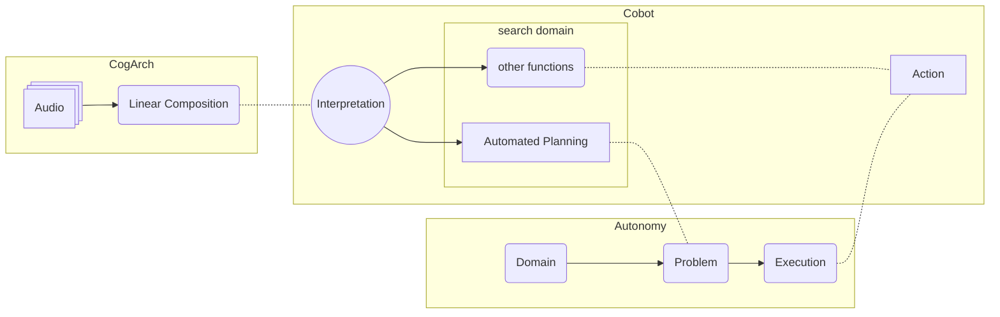
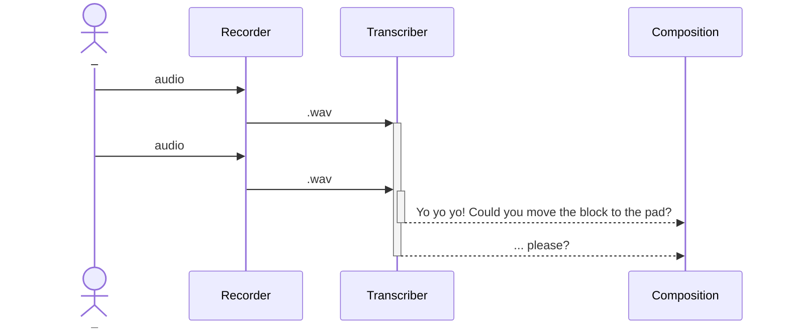

# complex-cobot
This project combines three smaller projects into one.

## Running
### Set up
Required Python packages:
`openai`, `pyaudio`, `whisper` (pip install git+https://github.com/openai/whisper.git), `pyniryo2`, `unified-planning`, `unified-planning[pyperplan]`

Make sure the microphone works, and if not running as mock, that a Ned2 (or other) is connected.

### Run
```
$ python3 unify.py 
```
Then tell it to do something, e.g. stack the blocks in reverse, sleep for 10 seconds, or move a block onto a pad.


## Components

### [CogArch](https://github.com/ogoudey/cog_arch)
A very minimal cognitive architecture. See arguments at the [repo](https://github.com/ogoudey/cog_arch) on which this is based.

Using two threads for recording and two for transcribing, we have a shortcut to a stream. As a form of communication, we here assume external, verbal (auditory) English is the best.

### [Cobot](https://github.com/ogoudey/simple_cobots)
In addition to the requirements of communication, the robot is declared to be "collaborative" (the "co-" in "cobot"). It is collaborative with humans not only in that it parses human language: it also associates the language with actions. This is done with another foundational model. The "actions" are function calls from a defined set of functions, like a menu for the LLM to pick from. In the first figure this is called the Search Domain, but it should really be called a "domain for association". Below, this domain is called the Unified Library.

The response varies a lot, but consequent accuracy can be easily tinkered with.

### [Autonomy](https://github.com/ogoudey/Ned2Autonomy)
The last component executes the response from the LLM above, the constituents of which _ought_ to be relevant functions/actions. Among these actions, and in the Unified Library, are "planning problems", i.e. actions that require "forethought". There are benefits to this approach for transparency. Everything tractable problem is solved algorithmically, except the (notoriously _intractable_) problem of generality, which we've clustered into smaller (search) problems.
