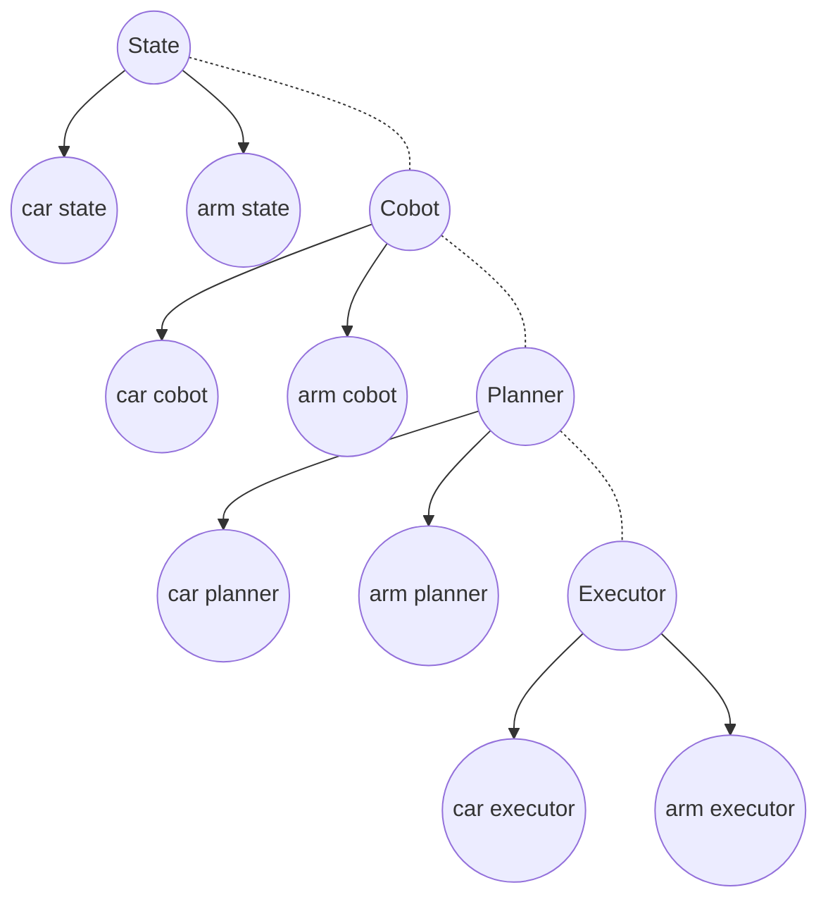
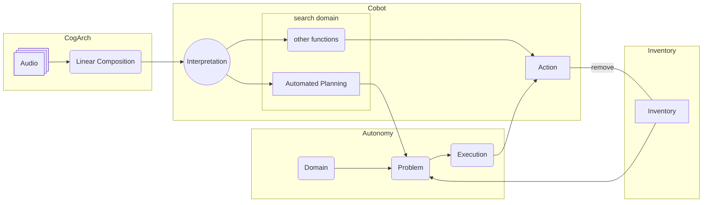
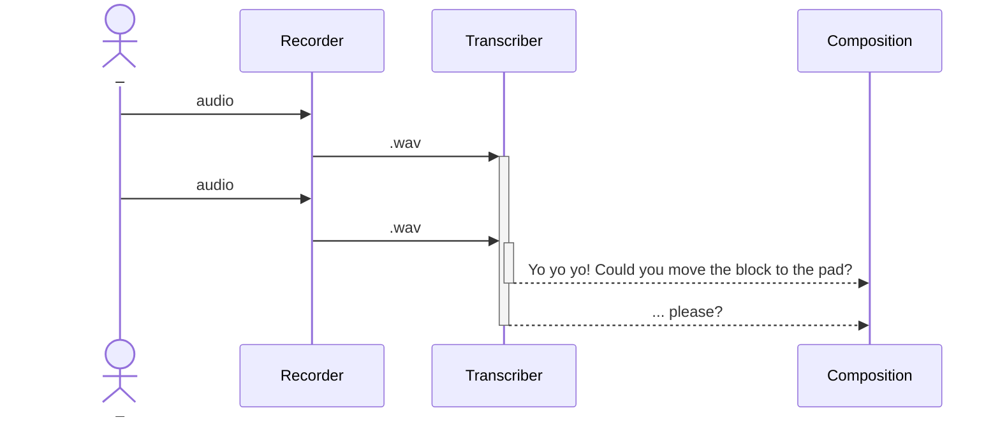

# Complex Cobotics Framework
A framework for interaction with cobots. So far it has been applied to two robots, a robotic arm and a wheeled robot (below, arm and car). 

State variables are passed to the collaborative part. To collaborate, the robot associates (by an LLM) transcriptions of sensory input to functions from a defined library. If these functions call for planning (they are "complex") a planning domain will be instantiated with the current state variables, solved, and then executed (updating the state).

This codebase does not have a good UI. To run the arm class or the car class, one must swap variables in the code manually. Furthermore (another TODO), the cobot or the state classes are not yet made generic yet, as they should be:



# More on How it Works
## Components

### [CogArch](https://github.com/ogoudey/cog_arch)
A very minimal cognitive architecture. See arguments at the [repo](https://github.com/ogoudey/cog_arch) on which this is based.

Using two threads for recording and two for transcribing, we have a shortcut to a stream. As a form of communication, we here assume external, verbal (auditory) English is the best. The output is a sequence of text.

### [Cobot](https://github.com/ogoudey/simple_cobots)
In addition to the requirements of communication, the robot is declared to be "collaborative" (the "co-" in "cobot"). It is collaborative with humans not only in that it parses human language: it also associates the language with actions. This is done with another foundational model. The "actions" are function calls from a defined set of functions, like a menu for the LLM to pick from. In the first figure this is called the Search Domain, but it should really be called a "domain for association". Below, this domain is called the Unified Library.

The response is the interpretation, which chooses what to do next.

### [Autonomy](https://github.com/ogoudey/Ned2Autonomy)
Should the interpretation yield a "complex" action (a "planning problem"), the cobot will call a planner. The problem domain for the planner is derivative: Each time a complex action is required, the domain refers to the `Inventory` for what the domain actually is.

## Running
### Set up
For the full version, the equired Python packages are:
`openai`, `pyaudio` (`sudo apt install portaudio19-dev` might be required), `whisper` (`pip install git+https://github.com/openai/whisper.git`), `pyniryo2`, `unified-planning`, `unified-planning[pyperplan]`

Make sure the microphone works, and if not running as mock, that a Ned2 (or other) is connected.

### Run
```
$ python3 unify.py 
```
Then tell it to do something, e.g. stack the blocks in reverse, sleep for 10 seconds, or move a block onto a pad.

To run without recording audio (just keyboard input):
```
$ python3 unify.py -d
```
